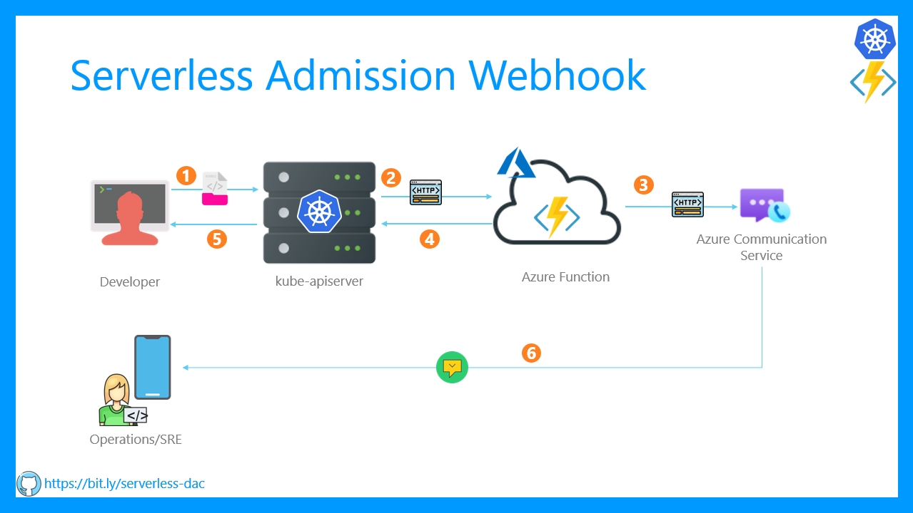

# Serverless Validation Admission Webhook in Kubernetes

> The implementation of validating webhook Azure Function that uses Azure Communication Service is available in the [feature/impl-azure-comm-service](https://github.com/rahulrai-in/az-fx-k8s-admission-control/tree/feature/impl-azure-comm-service) branch. The Twilio based implementation is available in the [master](https://github.com/rahulrai-in/az-fx-k8s-admission-control/tree/master) branch.

This sample application uses Azure function as a webhook to validate deployments created or updated in a Kubernetes cluster. In case a deployment does not meet the constraints defined in the function, it is rejected.

The Function also uses sends a text message to notify SRE or Operations team on the outcome of the validation. Following is a high level design diagram of the application.

## Watch the video

To learn more about this application watch the video here: <>
